# Ex-09-Data-Visualization-

Date - 

Colab Link -https://colab.research.google.com/drive/1po7Gzv3n3i4tai2Oh5NPY10gM6KPI09j?usp=sharing

Github Link -https://github.com/KATHIR1611/Ex-08-Data-Visualization_1

## AIM
To Perform Data Visualization on a complex dataset and save the data to a file. 

# Explanation
Data visualization is the graphical representation of information and data. By using visual elements like charts, graphs, and maps, data visualization tools provide an accessible way to see and understand trends, outliers, and patterns in data.

# Algorithm
### STEP 1
Read the given Data
### STEP 2
Clean the Data Set using Data Cleaning Process
### STEP 3
Apply Feature generation and selection techniques to all the features of the data set
### STEP 4
Apply data visualization techniques to identify the patterns of the data.


# Code

Data Processing.
```
import seaborn as sns
import pandas as pd
import matplotlib.pyplot as plt
df = sns.load_dataset("tips")
print(df)

df.isnull().sum()
```
Handling and Removing Outliers.
```
plt.figure(figsize=(8,8))
plt.title("Data with Outliers")
df.boxplot()
plt.show()

plt.figure(figsize=(8,8))
cols = ['size','tip','total_bill']
Q1 = df[cols].quantile(0.25)
Q3 = df[cols].quantile(0.75)
IQR = Q3 - Q1
df = df[~((df[cols] < (Q1 - 1.5 * IQR)) |(df[cols] > (Q3 + 1.5 * IQR))).any(axis=1)]
plt.title("Dataset after removing outliers")
df.boxplot()
plt.show()
```
Day of the week that has the highest total bill amount.
```
sns.barplot(x=df['day'], y=df['total_bill'], hue=df['day'])
plt.legend(loc="center")
plt.title("Highest Total Bill Amount by day of the week")
plt.show()
```

Average tip amount given by smokers and non-smokers.
```
sns.boxplot(x=df['smoker'], y=df['tip'], hue=df['smoker'])
plt.title("Average Tip Amount given by smokers and non-smokers")
```

The tip percentage vary based on the size of the dining party.
```
df["tip_percent"] = df["tip"] / df["total_bill"]
sns.scatterplot(x=df['size'],y=df['tip_percent'],data=df)
plt.title("Tip Percentage by Dining Party Size")
```

Gender which tends to leave higher tips.
```
sns.boxplot(x=df['sex'], y=df['tip'],hue=df['sex'])
plt.title("Tips based on gender")
```

Relationship between the total bill amount and the day of the week.
```
sns.scatterplot(x=df['day'],y=df['total_bill'],hue=df['day'])
plt.legend(loc="best")
plt.title("Total bill amount by day of the week")
```
Distribution of total bill amounts which vary across different time periods (lunch vs. dinner).
```
sns.histplot(data=df, x="total_bill", hue="time", element="step", stat="density")
plt.title("Distribution of Total Bill Amounts by Time of Day")
plt.show()
```
Dining party size group tends to have the highest average total bill amount.
```
sns.barplot(x=df['size'],y=df['total_bill'],hue=df['size'])
plt.title("Average Total Bill Amount by Dining Party Size")
plt.show()
```
The distribution of tip amounts for each day of the week.
```
sns.boxplot(x="day", y="tip", data=df)
plt.title("Tip Amount by Day of Week")
plt.show()
```
The tip amount that vary based on the type of service (lunch vs. dinner).
```
sns.violinplot(x="time", y="tip", data=df)
plt.title("Tip Amount by Time of Day")
plt.show()
```
Correlation between the total bill amount and the tip amount.
```
sns.scatterplot(x="total_bill", y="tip", data=df)
plt.title("Correlation between Tip Amount and Total Bill Amount")
plt.show()
```
# Output

Data Processing

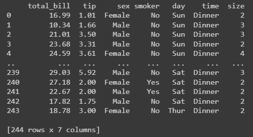

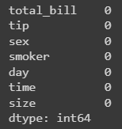

Handling and Removing Outliers


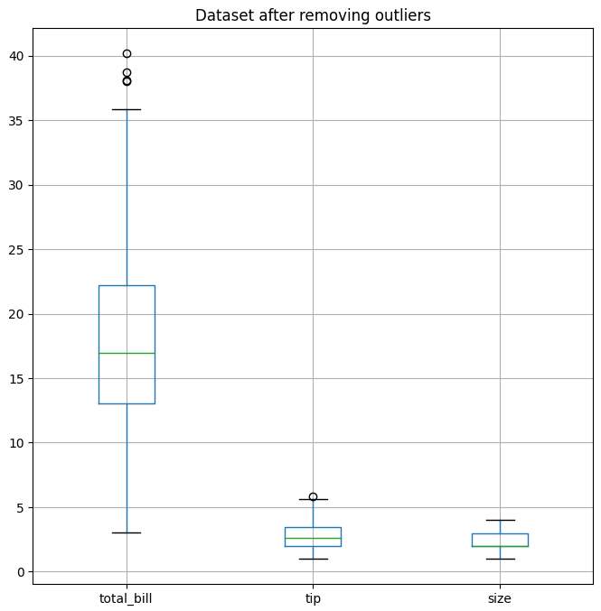

Day of the week that has the highest total bill amount

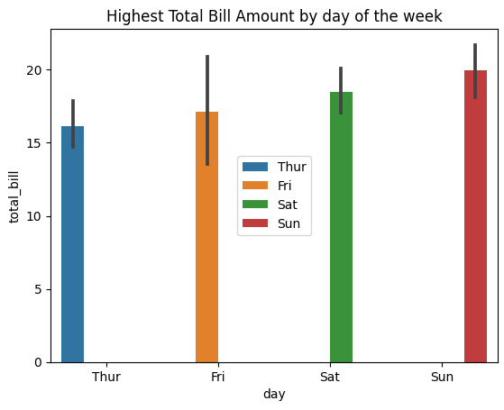

Average tip amount given by smokers and non-smokers


The tip percentage vary based on the size of the dining party

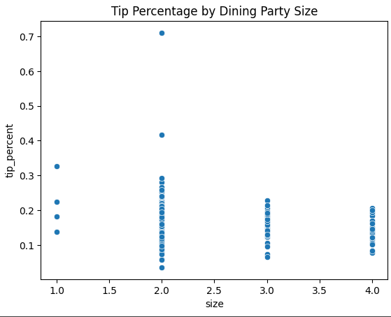

Gender which tends to leave higher tips

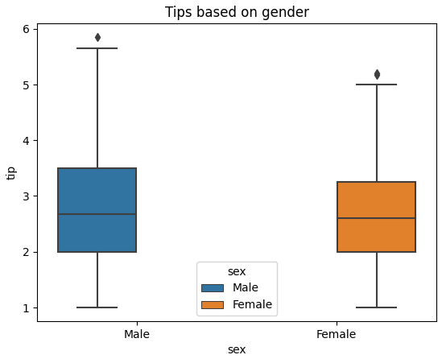

Relationship between the total bill amount and the day of the week

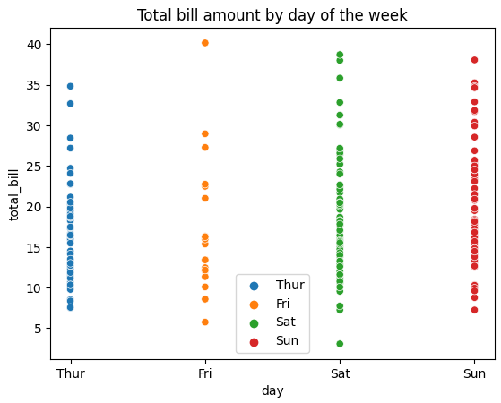

Distribution of total bill amounts which vary across different time periods (lunch vs. dinner)

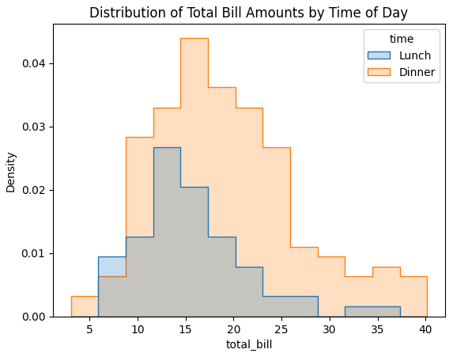

Dining party size group tends to have the highest average total bill amount


The distribution of tip amounts for each day of the week

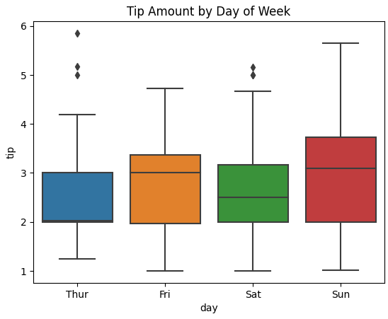

The tip amount that vary based on the type of service (lunch vs. dinner)

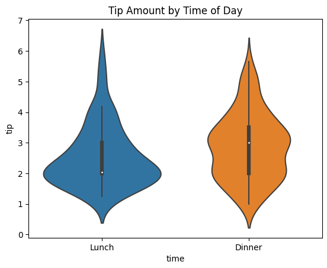

Correlation between the total bill amount and the tip amount

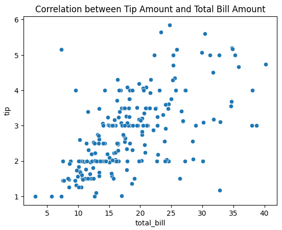

# Result
Thus the Data Visualization method is performed to the given data and to predict the outcome for the given question.


